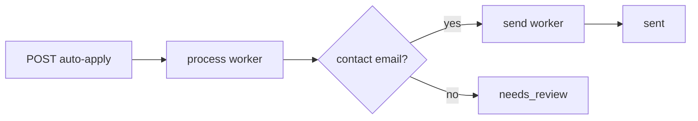

# Async processing

Long-running work runs outside the HTTP thread via BullMQ.

## Queues

| BullMQ name | DB `job_type` | Deterministic ID |
|-------------|---------------|------------------|
| `process-application` | `ai_process` | `process:application:{applicationId}` |
| `send-application` | `send_email` | `send:application:{applicationId}` |

## End-to-end flow

1. Controller creates rows and enqueues process job → **202**.
2. Process worker: parse JD, match, generate email → `generated` or `needs_review`.
3. If `generated` + email → enqueue send job.
4. Send worker: SMTP → CAS `generated` → `sent`.

## Worker bootstrap

| Environment | Behavior |
|-------------|----------|
| `NODE_ENV=development` (API process) | Inline workers via `shouldRunInlineWorkers()` |
| `NODE_ENV=production` | Separate `npm run worker` |
| `NODE_ENV=test` | No inline workers |

No `WORKER_MODE` env — see [`queue.config.js`](../../src/config/queue.config.js).

## Concurrency (code constants)

| Worker | Concurrency |
|--------|-------------|
| process | 2 |
| send | 3 |

Scale horizontally with more worker processes, not env knobs.

## Retry attempts

| Queue | Max attempts |
|-------|--------------|
| process | 3 |
| send | 5 |

## Recovery

`recovery.job.js` re-enqueues stuck `application_jobs`; skips `needs_review` / `review_reason` applications.

## Related Documentation

- [../queues/README.md](../queues/README.md)
- [../workers/README.md](../workers/README.md)
- [../adr/002-deterministic-job-ids.md](../adr/002-deterministic-job-ids.md)
- [../adr/005-worker-owned-ai-lifecycle.md](../adr/005-worker-owned-ai-lifecycle.md)
