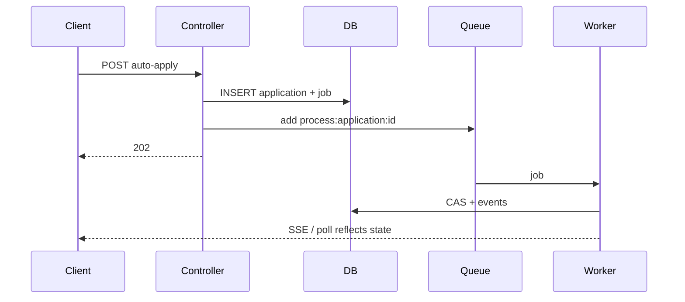

# Ownership boundaries

Explicit ownership prevents architectural erosion under production load.

## Ownership matrix

| Layer | Owns | Must not own |
|-------|------|--------------|
| **Controllers** | Input validation, auth check, initiating DB rows, enqueueing BullMQ, HTTP status codes | LLM calls, SMTP, long retries, CAS-heavy workflows end-to-end |
| **Workers** | Long execution, AI, SMTP, job state transitions, business CAS (via services), events, realtime publish | HTTP response formatting, session auth |
| **Queues (BullMQ)** | Durability, scheduling, backoff, stall detection | Business rules, SQL |
| **applications** | Business truth (`application_status`, email content, review) | Per-attempt execution detail |
| **application_jobs** | Execution truth per attempt | Business-only terminal meaning without application row |
| **application_events** | Audit truth | Current state for automation |
| **uiStatus** | Presentation truth (derived) | Any persistence |

## Controller contract

```txt
validate → persist (minimal) → enqueue → respond
```

- Prefer **202 Accepted** when work continues async.
- Return poll/SSE hints via status payload, not ad-hoc side channels.

## Worker contract

```txt
receive job → process → update job state → CAS business state → append event → publish realtime
```

- Own retries for transient failures (BullMQ + classified errors).
- Use `UnrecoverableError` when job must not retry.

## Forbidden cross-boundary behavior

| Forbidden | Why | Do instead |
|-----------|-----|------------|
| `openai.chat` in controller | Blocks HTTP; no retry budget | Enqueue `ai_process` |
| `UPDATE applications SET application_status` raw in random service | Skips CAS/version | `transitionApplicationState` |
| Read `application_events` to decide send | Stale/event order | Latest job + business status |
| Store `uiStatus` in DB | Drift from jobs | Resolver at read time |
| Enqueue without deterministic ID | Duplicate workers | `process:application:{id}` pattern |

## Lifecycle ownership



## Related Documentation

- [system-invariants.md](system-invariants.md)
- [../backend/controllers.md](../backend/controllers.md)
- [../workers/README.md](../workers/README.md)
- [../development/anti-patterns.md](../development/anti-patterns.md)
- [../adr/004-thin-controller-architecture.md](../adr/004-thin-controller-architecture.md)
