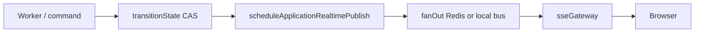

# Realtime architecture

Push updates to the browser via SSE, with polling as fallback. Orchestration keeps multi-tab state consistent.

## Publish path

Workers do not import SSE modules — they trigger DB transitions; publisher runs after persist.

## SSE endpoint

`GET /api/realtime/stream` — `Authorization: Bearer <JWT>`.

Client uses `fetch` + `ReadableStream` (not `EventSource`) for JWT header support.

## Transport modes

| Mode | When |
|------|------|
| **Redis pub/sub** | `REDIS_URL` set |
| **In-process bus** | No Redis — API process only |

Channel constant: `ai-apply:realtime` in [`redis.config.js`](../../src/config/redis.config.js).

## Orchestration handshake (leader tab)

1. `GET /api/orchestration/active` — snapshot with `version`, `orchestrationEpoch`, `terminal`, `pollable`
2. `registry.hydrateFromServer`
3. Drain pre-hydration buffer (max 50 events)
4. Open SSE

Follower tabs sync via `BroadcastChannel` (`ai-apply-orchestration`).

## Reconciliation

`shouldApplyEvent` rejects stale `version` / `epoch` / `updatedAt`. Repeated rejects → `registry.invalidate` + re-hydrate.

Debug deep traces: `DEBUG=orchestration` (server) / `VITE_DEBUG=orchestration` (client) — single scope, not per-subsystem env vars.

## Polling fallback

| Condition | Interval |
|-----------|----------|
| SSE disconnected | 3000 ms (`APPLICATION_POLL_MS`) |
| SSE connected | 30000 ms safety net |
| Max poll budget | 180000 ms per app |

Source: [`client/src/constants/polling.ts`](../../client/src/constants/polling.ts).

## Heartbeat

SSE heartbeat: **25000 ms** — [`realtime.config.js`](../../src/config/realtime.config.js).

## Terminal applications

Backend skips publish for terminal apps (`REALTIME_TERMINAL_SKIP`). Client prunes from orchestration registry.

## Related Documentation

- [../frontend/realtime-orchestration.md](../frontend/realtime-orchestration.md)
- [../frontend/status-and-polling.md](../frontend/status-and-polling.md)
- [../examples/sse-events.md](../examples/sse-events.md)
- [../adr/006-sse-over-pure-websocket.md](../adr/006-sse-over-pure-websocket.md)
