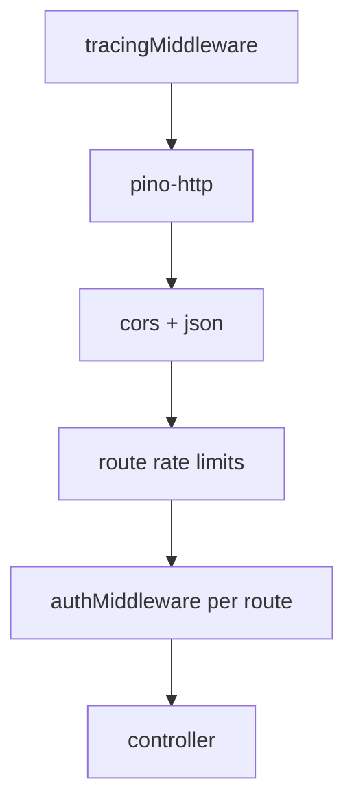
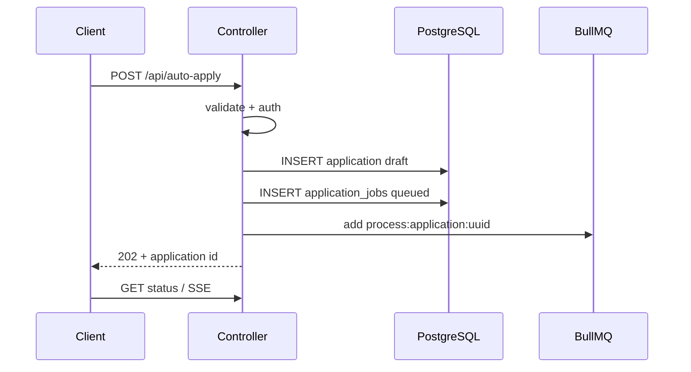

# Request lifecycle

HTTP request path from connection to response. Order in [`index.js`](../../index.js) matters.

## Middleware chain

| Order | Middleware | Purpose |
|-------|------------|---------|
| 1 | `tracingMiddleware` | `req.requestId` + `req.traceId` (`X-Trace-Id`); AsyncLocalStorage for downstream logs |
| 2 | `pino-http` | Structured access logs |
| 3 | `cors`, `express.json` | CORS + body |
| 4 | Tiered rate limits | `upload`, `apply`, `read`, `autoApply` |
| 5 | `authMiddleware` | JWT on protected routes |

## Rate limit tiers

| Tier | Routes |
|------|--------|
| upload | resume, JD upload |
| apply | apply, send, continue, retry |
| autoApply | `/api/auto-apply` |
| read | applications list, status, AI creds read |

## Typical async request

## Response patterns

| Pattern | When |
|---------|------|
| **200** | Sync read or immediate result |
| **202** | Work enqueued (auto-apply, send queued) |
| **304** | Status poll ETag match |
| **4xx** | Validation, auth, conflict |
| **5xx** | Unexpected server error |

Errors use [`httpErrorResponse.js`](../../src/utils/httpErrorResponse.js) / [`response.js`](../../src/utils/response.js) shapes.

## Internal routes

| Route | Auth |
|-------|------|
| `GET /health` | Public |
| `GET /internal/queue-health` | `x-internal-api-key` |
| `GET /internal/provider-health` | `x-internal-api-key` |

## Static SPA

Production serves Vite build from `public/`; API routes take precedence; fallback to `index.html`.

## Correlation IDs

| Field | Scope | Propagation |
|-------|-------|-------------|
| `traceId` | End-to-end flow | `X-Trace-Id` header or same as `requestId`; AsyncLocalStorage |
| `requestId` | HTTP request | `X-Request-Id` |
| `orchestrationId` | Per application | `applicationId` |
| `jobId` | Worker job | Bull `job.id` + `job.data.requestId` when enqueued |
| `eventId` | SSE/replay transport | Replay buffer only — not business ordering |

Workers run inside `runWithTrace()` so logs avoid `requestId: UNKNOWN`. Realtime publish logs include `traceId`, `applicationId`, `version`, `eventId`, `publishSource`.

## Related Documentation

- [async-processing.md](async-processing.md)
- [db-pool-lifecycle.md](db-pool-lifecycle.md)
- [ownership-boundaries.md](ownership-boundaries.md)
- [../api/README.md](../api/README.md)
- [../backend/middleware.md](../backend/middleware.md)
