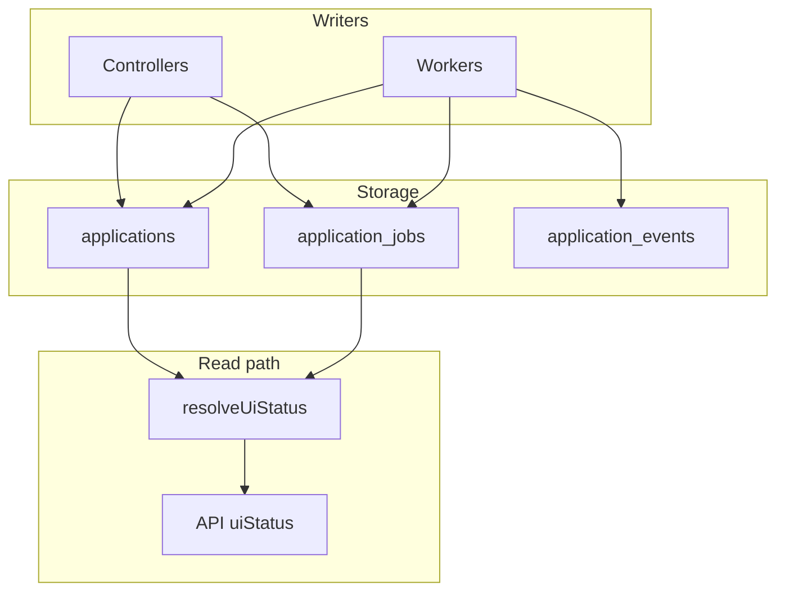

# State model

The platform separates **what the business means**, **what execution is doing**, **what happened**, and **what the UI should show**.

## Four layers

```txt
applications       = business truth
application_jobs   = execution truth
application_events = audit truth
uiStatus           = derived truth
```



## Why separate layers

| Problem without separation | How layers help |
|----------------------------|-----------------|
| UI shows “sending” while business is `failed` | Derive UI from jobs + business |
| Retry creates ambiguous single `status` column | New job row per attempt; business updated via CAS |
| Audit trail overwritten | Events append-only |
| Polling on wrong field | `pollable` from resolver, not raw enum |

## Business truth (`applications.application_status`)

| Status | Meaning |
|--------|---------|
| `draft` | Created; AI not finished |
| `generated` | Email ready; can send |
| `needs_review` | Human must fix contact (`review_reason`) |
| `sent` | SMTP delivered |
| `failed` | Workflow failed; automation stopped |
| `cancelled` | User cancelled |

Mutations go through `transitionApplicationState()` with CAS expectations.

## Execution truth (`application_jobs`)

| Status | Meaning |
|--------|---------|
| `queued` | Waiting for worker |
| `processing` | Worker active |
| `retrying` | Recovery/retry in progress |
| `completed` | Attempt succeeded |
| `failed` | **This attempt** failed |

Job types: `ai_process`, `send_email`.

**Retry rule:** Do not update old job rows on retry — insert a new row. See dual `failed` below.

## Audit truth (`application_events`)

Append-only records: `event_type`, `actor_type` (`system` | `user` | `worker`), `metadata` JSON.

Used for lineage (`attemptNumber`, `previousJobId`, `retrySource`) — not for driving workers.

## Derived truth (`uiStatus`)

Computed in `serializeApplication()` → `resolveUiStatus()` pipeline:

1. Terminal business: `sent`, `cancelled`
2. Review: `needs_review`
3. Business failed
4. Active job `retrying`
5. Active `send_email`
6. Active `ai_process`
7. Idle `generated`
8. `draft` fallback

Capabilities: `pollable`, `canRetry`, `canContinue`, `terminal`.

**Never persist `uiStatus`.**

## Dual `failed` semantics

| Layer | Field | Meaning |
|-------|--------|---------|
| Business | `application_status = failed` | Automation stopped; user may retry workflow |
| Execution | `application_jobs.status = failed` | One attempt failed; row is history |

A failed job row can coexist with `draft` or `generated` after user retry.

Code: `src/domain/applicationStatus/failureSemantics.js`.

## Orchestration versioning

`orchestration_version` / `orchestration_epoch` on `applications` support client ordering — mutated only via `transitionApplicationState()` bump rules.

## Related Documentation

- [system-invariants.md](system-invariants.md)
- [ownership-boundaries.md](ownership-boundaries.md)
- [../frontend/ui-status-rendering.md](../frontend/ui-status-rendering.md)
- [../adr/001-three-truths-model.md](../adr/001-three-truths-model.md)
- [../adr/007-append-only-events.md](../adr/007-append-only-events.md)
