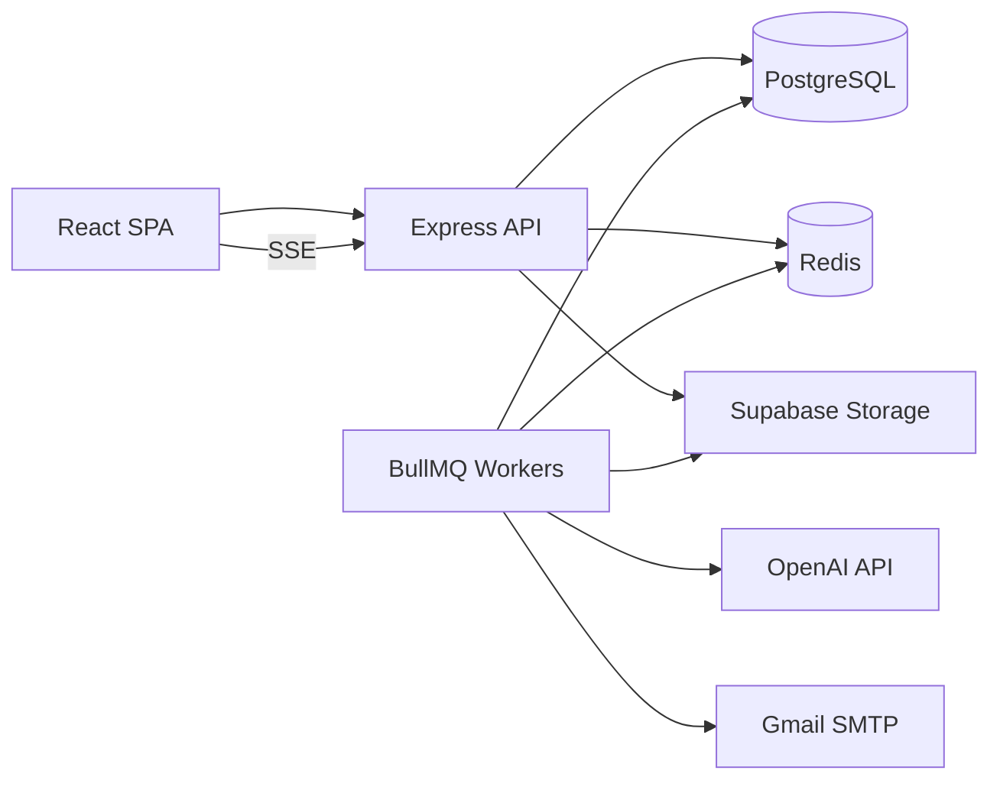

# System overview

AI Apply is a Node.js monolith (Express API + React SPA) with Redis-backed BullMQ workers and PostgreSQL as the system of record.

## High-level topology



## Responsibilities

| Component | Role |
|-----------|------|
| **API** | Auth, validation, persistence initiation, enqueue, status queries, SSE |
| **Workers** | AI parsing/generation, SMTP, CAS transitions, events, realtime publish |
| **PostgreSQL** | Business state, job history, audit events, credentials |
| **Redis** | BullMQ queues + optional realtime fan-out |
| **Client** | Setup, dashboard, applications table, orchestration + poll/SSE |

## Sync vs async

| Sync (HTTP) | Async (workers) |
|-------------|-----------------|
| Signup/login | JD parse + match + email generation |
| Upload resume/JD | SMTP send |
| Create application row + job row | Recovery re-enqueue |
| Enqueue BullMQ job | LLM calls |

HTTP returns **202** for long workflows; clients poll `GET /api/applications/:id/status` and/or subscribe to SSE.

## Truth model (summary)

```txt
applications       = business truth
application_jobs   = execution truth
application_events = audit truth
uiStatus           = derived truth
```

See [state-model.md](state-model.md).

## Primary user flow

1. User completes setup (resume, Gmail creds, optional AI creds).
2. `POST /api/auto-apply` creates application (`draft`), `ai_process` job, enqueues `process:application:{id}`.
3. Process worker → `generated` or `needs_review`.
4. If contact email present → enqueue `send:application:{id}`.
5. Send worker → CAS `generated` → `sent`.

## Configuration

All env is loaded via [`src/config/`](../../src/config/). See [../development/environment.md](../development/environment.md).

## Related Documentation

- [state-model.md](state-model.md)
- [async-processing.md](async-processing.md)
- [../backend/README.md](../backend/README.md)
- [../adr/001-three-truths-model.md](../adr/001-three-truths-model.md)
