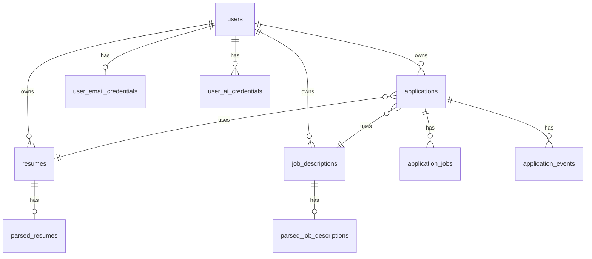

# Database schema

**Source:** `src/migrations/` (17 files). Events table = `application_events` (no standalone `events`).

## ER overview

## Core tables

| Table | Truth layer | Purpose |
|-------|-------------|---------|
| `applications` | Business | Workflow state, email content, orchestration version |
| `application_jobs` | Execution | Per-attempt job tracking |
| `application_events` | Audit | Append-only history |
| `users` | Identity | Auth |
| `resumes` / `job_descriptions` | Inputs | Uploaded content |
| `parsed_*` | Derived storage | LLM JSON snapshots |
| `user_email_credentials` | Secrets | Gmail app passwords (encrypted) |
| `user_ai_credentials` | Secrets | BYOK keys + chain |
| `llm_usage_logs` | Observability | Token/cost logging |
| `failed_parses` | Diagnostics | Parse failures by hash |

## applications (key columns)

| Column | Notes |
|--------|-------|
| `application_status` | enum: draft, generated, needs_review, sent, failed, cancelled |
| `email_subject`, `email_body` | Generated content |
| `review_reason` | Human review required |
| `orchestration_version`, `orchestration_epoch` | Client ordering |
| `recipient_email` | Send target |

Legacy `email_status` removed in 011b.

## application_jobs

| Column | Notes |
|--------|-------|
| `job_type` | `ai_process`, `send_email` |
| `status` | queued, processing, retrying, completed, failed |
| `bullmq_job_id` | Optional cross-ref |

## application_events

Append-only. `actor_type`: system, user, worker.

## Related Documentation

- [migrations.md](migrations.md)
- [indexes-and-recovery.md](indexes-and-recovery.md)
- [../architecture/state-model.md](../architecture/state-model.md)
