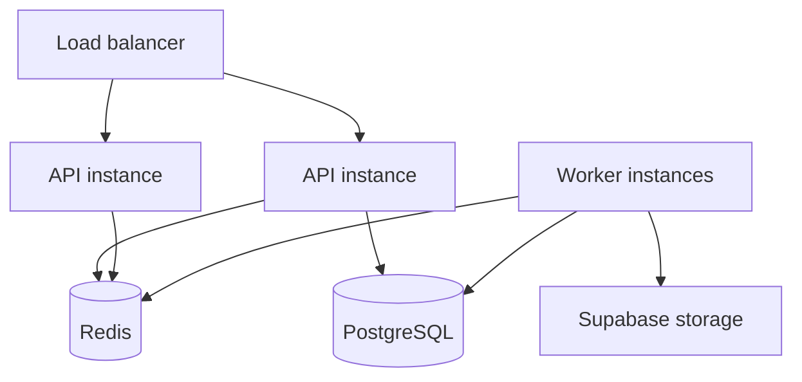

# Deployment architecture

| Process | Responsibility |
|---------|----------------|
| API | HTTP + SSE + static UI |
| Worker | BullMQ consumers |
| Redis | Queues + realtime pub/sub |
| Postgres | State |
| Supabase | PDF storage |

## Related Documentation

- [production-startup-order.md](production-startup-order.md)
