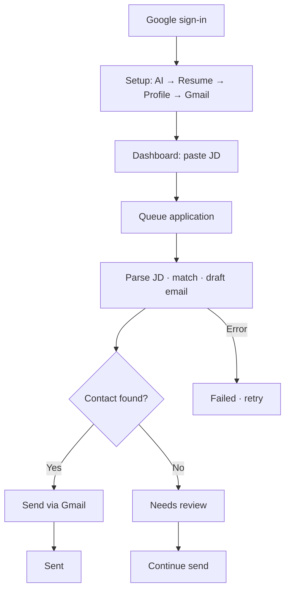

# One Tap — Product Requirements Document (PRD)

> **Audience:** Product managers, stakeholders, design, and business partners  
> **Last updated:** June 2, 2026  
> **Companion doc:** [Technical PRD](./Technical-PRD.md) · [Engineering hub](../README.md)

---

## 1. Document overview

| Field | Value |
| --- | --- |
| Product | One Tap |
| Version | 1.0 (MVP+) |
| Users | Job seekers applying at volume |
| Stack | React (Vercel) + Node API (Render) + Supabase auth |
| Model | Freemium — core apply workflow free; Pro adds speed, profiles, analytics |

---

## 2. Executive summary

**One Tap** automates job outreach: parse resume + job description, score fit, draft a tailored email, send via the user’s Gmail. Work is **async** — users paste a JD, the system queues processing, and the applications list updates in near real time.

**Today:** Setup → auto-apply → track → retry/continue is shipped and production-capable.

**Direction:** Evolve from “AI email tool” to a **career operating system** — apply faster, stay organized, apply smarter (see §4).

**Next focus (P0):** Onboarding, trusted AI models, applicant profile data, JD-aware email generation, tone + structure.

---

## 3. Positioning & moat

### Narrative

> **One Tap** — the fastest way to apply, track, and improve your job search.

Not: AI email generator · sales CRM for candidates · resume-only optimizer.

### Three pillars

| Pillar | Promise |
| --- | --- |
| **Apply faster** | One-tap flows, less copy-paste, async automation |
| **Stay organized** | Every application, status, and action in one place |
| **Apply smarter** | Learn what actually gets interviews |

### Moat statement

One Tap is building the **operating system for modern job seekers**: apply in seconds, manage every application in one place, and use real-world application intelligence to improve interview odds.

### How the moat compounds

| Horizon | Expansion |
| --- | --- |
| Today | One-tap apply + reliable tracking |
| 6 months | LinkedIn extension + cross-channel tracking |
| 12 months | Intelligence loops (tone, JD compliance, profile routing) |
| 24 months | Outcome-linked dataset from application telemetry |

---

## 4. North Star metrics

| Phase | North Star | Definition |
| --- | --- | --- |
| **Current** | Applications successfully sent | Count of applications reaching terminal `sent` |
| **Future** | Recruiter response rate | Applications with recruiter reply ÷ applications sent |

Supporting metrics: setup completion, send success rate, time-to-sent (p50/p95), needs-review rate, retry rate, match score distribution.

---

## 5. Problem, vision & goals

### Problem

- High-volume applying repeats the same work: read JD, tailor message, find contact, send.
- Generic templates underperform; manual tailoring does not scale.
- Tools that block the browser or fail silently erode trust.

### Vision

Default **application operations hub** for active job seekers: configure once, apply many times, see honest status for every attempt.

### Product goals (MVP+)

| ID | Goal | Success looks like |
| --- | --- | --- |
| G1 | One-click apply | Paste JD → draft (+ send when possible) |
| G2 | Trustworthy status | Clear queued / processing / needs review / sent / failed |
| G3 | User-owned channels | Gmail send + optional BYOK AI |
| G4 | Recoverability | Retry and continue without losing history |
| G5 | Transparency | Match score and role context per application |

### Non-goals (now)

Job board aggregation · two-sided marketplace · native mobile apps · in-app inbox (reply tracking is future; schema hooks exist).

---

## 6. Users & personas

| Persona | Behavior | Needs |
| --- | --- | --- |
| **Volume Alex** | 10–50 apps/week | Speed, Gmail + API setup OK |
| **Careful Casey** | Selective applies | Review drafts, fix missing contacts |
| **Builder Blake** | Technical user | BYOK, credential chain, audit trail |

---

## 7. Product experience

### 7.1 End-to-end flow

> **Target setup order (P0):** AI key first (resume parse depends on it) → Resume → Applicant profile → Gmail.

### 7.2 Setup & pages

| Step | Surface | Action |
| --- | --- | --- |
| 1 | `/login` | Google OAuth |
| 2 | `/setup` | AI credentials, resume, profile, Gmail |
| 3 | `/dashboard` | Readiness + paste JD + Auto Apply |
| 4 | `/applications` | List, filter, detail, retry/continue |

### 7.3 Application statuses (user-facing)

Derived status — not raw DB enums.

| Status | Meaning | User action |
| --- | --- | --- |
| Processing | AI parsing JD / drafting | Wait |
| Sending | Email in flight | Wait |
| Ready / Generated | Draft ready | Wait or review |
| Needs review | Missing recipient | Add email, continue |
| Sent | Delivered | None |
| Failed | Workflow error | Retry |
| Cancelled | Stopped | None (unless retry allowed) |

**Rule:** A failed *attempt* may retry as a new execution without losing the application row.

---

## 8. Product status & roadmap

Single source of truth for what exists, what’s broken, and what’s next.

### 8.1 Shipped

| Area | Capability |
| --- | --- |
| Auth | Google via Supabase; per-user isolation |
| Setup | Resume, Gmail, AI credentials (3 cards) |
| Apply | Dashboard paste JD → async pipeline → optional auto-send |
| Tracking | Applications list: search, filter, sort, pagination, SSE |
| Matching | Resume↔JD score + matched/missing skills |
| Email | LLM subject/body; Gmail SMTP |
| Lifecycle | Retry, continue (needs review), cancel |
| AI | BYOK, provider chain, health check |

### 8.2 Known gaps (in progress)

| Gap | Impact |
| --- | --- |
| Resume parsing on some free models | Timeouts, 429s — see engineering failure log |
| Slow-feeling resume upload | Some paths still HTTP-bound vs worker-owned |

### 8.3 Prioritized backlog

| Pri | Feature | Outcome |
| --- | --- | --- |
| **P0** | [Applicant profile](#p0-applicant-profile) | Reusable CTC, notice period, locations, links for all AI flows |
| **P0** | [Guided onboarding](#p0-guided-onboarding) | API key → resume → profile → Gmail with in-product guidance |
| **P0** | [Validated AI models](#p0-validated-ai-models) | Provider → one key → curated model dropdown (Gemini 2.5 Lite first) |
| **P0** | [JD instruction compliance](#p0-jd-instruction-compliance) | Follow JD subject/format/field asks; omit missing data silently |
| **P0** | [Email tone slider](#p0-email-tone) | Casual ↔ professional, persisted default |
| **P0** | [Structured emails](#p0-structured-emails) | Scannable sections, not one paragraph |
| **P1** | [LinkedIn extension](#p1-linkedin-extension) | Apply from job post in ≤2 clicks |
| **P1** | [Multi-resume profiles](#p1-multi-resume) | Auto-pick resume by JD; attach correct PDF |
| P2 | Recruiter response tracking | Enable future North Star (response rate) |
| P2 | Email edit / regenerate in UI | Fix drafts without full re-parse |
| P2 | Application analytics | Volume, send rate, match distribution |
| P3 | Team seats, priority tier | Monetization + scale |

### 8.4 Release phases

| Phase | Theme | Deliverables |
| --- | --- | --- |
| **Now** | Core loop | Shipped items in §8.1 |
| **Next** | P0 | Profile, onboarding, models, JD compliance, tone, structure |
| **Then** | P1 | LinkedIn extension, multi-resume |
| **After** | P2+ | Response tracking, analytics, engagement signals |
| **Later** | Platform | Managed AI (Premium), semantic search, integrations |

---

## 9. Feature specifications (planned)

Detailed requirements for near-term work. Shipped behavior is summarized in §8.1 only.

### P0 — Applicant profile

**Problem:** CTC, notice period, locations, and links are re-entered or missing from emails; JDs often require them.

**Solution:** First-class **Applicant Profile** — reusable domain object for all AI workflows (email, JD compliance, extension, future intelligence).

| Field group | Fields |
| --- | --- |
| Compensation | Current CTC (amount + currency), expected CTC (amount + currency) |
| Availability | Notice period: Immediate · 15 · 30 · 45 · 60 · 90 days · Negotiable |
| Preferences | `preferred_locations` JSON array — e.g. `["Remote"]`, `["Remote","Bangalore"]` |
| Links | LinkedIn, portfolio, GitHub (validated URLs) |
| Meta | `profile_completion_percent` (0–100) |

**Completeness (8 fields):** Resume uploaded · current CTC · expected CTC · notice period · preferred locations · LinkedIn · portfolio · GitHub.

**Resume parse integration:** Extract links/location with confidence — auto-fill if >0.9, confirm if 0.6–0.9, ignore if <0.6. Never hallucinate. Parse failure must not block resume upload.

**AI rules:** Inject profile into every generation request. When JD asks for CTC/notice/location/links: include if present, **omit silently** if absent — never "N/A" or apologies.

**Audit:** Store `application_generation_context` snapshot per application so later profile edits do not rewrite history.

**Setup:** Dedicated Profile card — Incomplete / Partial / Complete with e.g. `6/8 fields completed`.

---

### P0 — Guided onboarding

**Problem:** Users don’t know credential order; resume parse fails without AI key.

**Flow:** (1) Add & validate AI API key → (2) Upload resume → (3) Complete applicant profile → (4) Gmail app password → (5) Ready + first apply CTA.

**Rules:** First Google login enters onboarding; resume step gated on valid AI key; resumable if user leaves mid-flow.

---

### P0 — Validated AI models

**Problem:** Free-text model names cause misconfiguration and failures.

**Flow:** Select provider → paste **one API key per provider** → choose model from **manually curated** list (start: **Gemini 2.5 Lite**). No auto-discovery of models.

**Rules:** New models only after internal QA. Provider-scoped dropdown. Runtime fallback to trusted default if needed.

---

### P0 — JD instruction compliance

**Problem:** JDs specify subject format (`Name - Role`) and required fields (CTC, notice, etc.); generation ignores or invents missing values.

**Solution:** Extract instructions → merge with applicant profile → generate with compliance checklist.

| Rule | Behavior |
| --- | --- |
| JD specifies format | Follow when parseable |
| JD asks for field | Include only if profile has value |
| Field missing | Omit completely — no placeholder or apology |
| Conflict with safety | Fall back to standard template |

**Acceptance:** ≥95% subject-format compliance when instructions parseable; preview shows Applied / Partial / Fallback.

---

### P0 — Email tone

Slider (casual ↔ professional) in Setup/Dashboard; persisted default; drives `toneType` in generation. Optional per-application override before send.

---

### P0 — Structured emails

Required sections: greeting · opening hook · fit (bullets/short lines) · CTA · sign-off. Validator + one auto-rewrite if structure fails. Target ≥95% compliance.

---

### P1 — LinkedIn extension

Chrome extension: **Apply with One Tap** on job posts → extract JD → same API pipeline as dashboard. No auto-click Easy Apply. Graceful fallback to web app.

---

### P1 — Multi-resume profiles

Multiple labeled resumes; auto-select best match for JD; user can override; attach selected PDF on send. List shows profile label.

---

## 10. Use cases

| ID | Scenario | Actor | Success |
| --- | --- | --- | --- |
| UC-01 | First-time setup | New user | All setup steps complete; auto-apply enabled |
| UC-02 | Happy-path apply | Configured user | JD → Processing → Sent; match visible |
| UC-03 | Missing contact | Configured user | Needs review → add email → Sent |
| UC-04 | Retry failure | Configured user | Failed → Retry → completes |
| UC-05 | Volume operations | Volume Alex | Filter/sort applications at scale |
| UC-06 | BYOK fallback | Builder Blake | Chain uses user keys first |
| UC-07 | Cancel | Any user | Terminal cancelled; no further send |
| UC-08 | Tone preference | Careful Casey | Professional tone + structured body |
| UC-09 | JD-specific subject/fields | Any user | Subject matches JD; only provided fields included |
| UC-10 | Trusted model setup | New user | Provider → key → Gemini 2.5 Lite from dropdown |
| UC-11 | Onboarding order | New user | API key before resume parse; guided Gmail setup |
| UC-12 | Applicant profile in email | Any user | JD asks CTC → included from profile or omitted |
| UC-13 | LinkedIn apply | Volume Alex | Extension queues app; same statuses as dashboard |
| UC-14 | Multi-resume routing | Volume Alex | Correct profile selected and attached |

---

## 11. Business model & pricing

### Philosophy

**Freemium, outcome-focused.** Free tier must complete the full apply workflow. Paid tiers sell convenience, speed, personalization, and intelligence — not core send capability.

### Plan matrix

| Feature | Free | Pro | Premium (future) |
| --- | :---: | :---: | :---: |
| Dashboard apply, email gen, tracking, tone | ✅ | ✅ | ✅ |
| Single resume, BYOK | ✅ | ✅ | Optional |
| Generous apply limits | ✅ | ✅ | ✅ |
| LinkedIn extension | ❌ | ✅ | ✅ |
| Multi-resume + auto-select | ❌ | ✅ | ✅ |
| Analytics, priority queue | ❌ | ✅ | ✅ |
| Recruiter intelligence | ❌ | Roadmap | ✅ |
| Managed AI, no API key | ❌ | ❌ | ✅ |
| Fastest queue | ❌ | ❌ | ✅ |

### Plans

| Plan | Price | For whom |
| --- | --- | --- |
| **Free** | ₹0 | BYOK users; core workflow; ~100 applications/week |
| **Pro** | ₹299–499/mo | Volume seekers; extension, multi-resume, analytics, priority |
| **Premium** | ₹999–1499/mo (future) | Turnkey: managed AI, premium models, advanced intelligence |

### Monetization phases

| Phase | Focus | Revenue |
| --- | --- | --- |
| Current | Acquisition, validation, volume | Pro subscriptions |
| Future | Managed AI, intelligence, response analytics | Premium + Pro |

**Guiding principle:** Never force payment to successfully apply. Paid = faster, smarter, less setup friction.

---

## 12. Constraints, risks & out of scope

### Constraints

| Constraint | Implication |
| --- | --- |
| Gmail app password | 2FA + education required |
| BYOK (typical) | User brings AI key; lower COGS, more setup |
| Single resume (today) | Multi-resume is P1 |
| English-first | Parsing/prompts tuned for English JDs |
| Async long work | UI must not imply instant completion |

### Risks

| Risk | Mitigation |
| --- | --- |
| AI timeouts / 429s | Trusted models, credential chain, worker retries |
| Wrong model selection | P0 curated dropdown |
| Missing recruiter email | Needs-review + continue (shipped) |
| Weak onboarding | P0 guided flow, API key first |
| Unstructured emails | P0 tone + structure + JD compliance |
| No reply tracking yet | P2 response tracking → future North Star |

### Out of scope

Cover letters for non-email portals · auto LinkedIn Easy Apply · legal review per jurisdiction · employer CRM · built-in job board.

---

## 13. Glossary

| Term | Definition |
| --- | --- |
| Application | One apply attempt: one JD + one resume (profile) |
| Applicant profile | Reusable candidate facts (CTC, notice, locations, links) |
| Auto-apply | Paste JD; system drafts and usually sends |
| BYOK | User-provided AI API key |
| Match score | Skill overlap between resume and JD (0–100) |
| Needs review | Missing contact before send |
| Terminal status | Sent, Failed, or Cancelled |
| Trusted model list | Manually QA’d models in dropdown only |

---

## 14. References

- [Technical PRD](./Technical-PRD.md) — architecture, APIs, implementation
- [Engineering glossary](../glossary.md)
- [Future architecture](../roadmap/future-architecture.md)

---

*Notion:* Import as Markdown. Enable Mermaid for diagrams.
