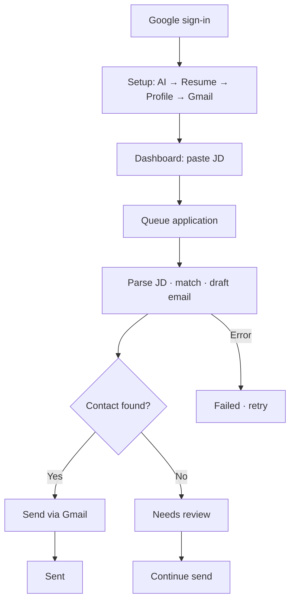

# One Tap — Product Requirements Document (PRD)

> **Audience:** Product managers, stakeholders, design, and business partners  
> **Last updated:** June 2, 2026  
> **Companion docs:** [Technical PRD](./Technical-PRD.md) · [Upcoming features](./upcoming-features.md) · [Engineering hub](../README.md)

---

## 1. Document overview

| Field | Value |
| --- | --- |
| Product | One Tap |
| Version | 1.0 (MVP+) |
| Users | Job seekers applying at volume |
| Stack | React (Vercel) + Node API (Render) + Supabase auth |
| Model | Freemium — core apply workflow free; Pro adds speed, profiles, analytics |

---

## 2. Executive summary

**One Tap** automates job outreach: parse resume + job description, score fit, draft a tailored email, send via the user’s Gmail. Work is **async** — users paste a JD, the system queues processing, and the applications list updates in near real time.

**Today:** Setup → auto-apply → track → retry/continue is shipped and production-capable.

**Direction:** Evolve from “AI email tool” to a **career operating system** — apply faster, stay organized, apply smarter (see §4).

**Planned work:** See [Upcoming features](./upcoming-features.md) for the prioritized checklist backlog.

---

## 3. Positioning & moat

### Narrative

> **One Tap** — the fastest way to apply, track, and improve your job search.

Not: AI email generator · sales CRM for candidates · resume-only optimizer.

### Three pillars

| Pillar | Promise |
| --- | --- |
| **Apply faster** | One-tap flows, less copy-paste, async automation |
| **Stay organized** | Every application, status, and action in one place |
| **Apply smarter** | Learn what actually gets interviews |

### Moat statement

One Tap is building the **operating system for modern job seekers**: apply in seconds, manage every application in one place, and use real-world application intelligence to improve interview odds.

### How the moat compounds

| Horizon | Expansion |
| --- | --- |
| Today | One-tap apply + reliable tracking |
| 6 months | LinkedIn extension + cross-channel tracking |
| 12 months | Intelligence loops (tone, JD compliance, profile routing) |
| 24 months | Outcome-linked dataset from application telemetry |

---

## 4. North Star metrics

| Phase | North Star | Definition |
| --- | --- | --- |
| **Current** | Applications successfully sent | Count of applications reaching terminal `sent` |
| **Future** | Recruiter response rate | Applications with recruiter reply ÷ applications sent |

Supporting metrics: setup completion, send success rate, time-to-sent (p50/p95), needs-review rate, retry rate, match score distribution.

---

## 5. Problem, vision & goals

### Problem

- High-volume applying repeats the same work: read JD, tailor message, find contact, send.
- Generic templates underperform; manual tailoring does not scale.
- Tools that block the browser or fail silently erode trust.

### Vision

Default **application operations hub** for active job seekers: configure once, apply many times, see honest status for every attempt.

### Product goals (MVP+)

| ID | Goal | Success looks like |
| --- | --- | --- |
| G1 | One-click apply | Paste JD → draft (+ send when possible) |
| G2 | Trustworthy status | Clear queued / processing / needs review / sent / failed |
| G3 | User-owned channels | Gmail send + optional BYOK AI |
| G4 | Recoverability | Retry and continue without losing history |
| G5 | Transparency | Match score and role context per application |

### Non-goals (now)

Job board aggregation · two-sided marketplace · native mobile apps · in-app inbox (reply tracking is future; schema hooks exist).

---

## 6. Users & personas

| Persona | Behavior | Needs |
| --- | --- | --- |
| **Volume Alex** | 10–50 apps/week | Speed, Gmail + API setup OK |
| **Careful Casey** | Selective applies | Review drafts, fix missing contacts |
| **Builder Blake** | Technical user | BYOK, credential chain, audit trail |

---

## 7. Product experience

### 7.1 End-to-end flow

> **Target setup order (P0):** AI key first (resume parse depends on it) → Resume → Applicant profile → Gmail.

### 7.2 Setup & pages

| Step | Surface | Action |
| --- | --- | --- |
| 1 | `/login` | Google OAuth |
| 2 | `/setup` | AI credentials, resume, profile, Gmail |
| 3 | `/dashboard` | Readiness + paste JD + Auto Apply |
| 4 | `/applications` | List, filter, detail, retry/continue |

### 7.3 Application statuses (user-facing)

Derived status — not raw DB enums.

| Status | Meaning | User action |
| --- | --- | --- |
| Processing | AI parsing JD / drafting | Wait |
| Sending | Email in flight | Wait |
| Ready / Generated | Draft ready | Wait or review |
| Needs review | Missing recipient | Add email, continue |
| Sent | Delivered | None |
| Failed | Workflow error | Retry |
| Cancelled | Stopped | None (unless retry allowed) |

**Rule:** A failed *attempt* may retry as a new execution without losing the application row.

---

## 8. Product status

What exists today and known gaps. **Backlog and specs:** [upcoming-features.md](./upcoming-features.md).

### 8.1 Shipped

| Area | Capability |
| --- | --- |
| Auth | Google via Supabase; per-user isolation |
| Setup | Resume, Gmail, AI credentials (3 cards) |
| Apply | Dashboard paste JD → async pipeline → optional auto-send |
| Tracking | Applications list: search, filter, sort, pagination, SSE |
| Matching | Resume↔JD score + matched/missing skills |
| Email | LLM subject/body; Gmail SMTP |
| Lifecycle | Retry, continue (needs review), cancel |
| AI | BYOK, provider chain, health check |
| Email prefs | Tone + structure sliders; preset derivation; generation snapshot on apply |

### 8.2 Known gaps (in progress)

| Gap | Impact |
| --- | --- |
| Resume parsing on some free models | Timeouts, 429s — see engineering failure log |
| Slow-feeling resume upload | Some paths still HTTP-bound vs worker-owned |

---

## 9. Use cases

| ID | Scenario | Actor | Success |
| --- | --- | --- | --- |
| UC-01 | First-time setup | New user | All setup steps complete; auto-apply enabled |
| UC-02 | Happy-path apply | Configured user | JD → Processing → Sent; match visible |
| UC-03 | Missing contact | Configured user | Needs review → add email → Sent |
| UC-04 | Retry failure | Configured user | Failed → Retry → completes |
| UC-05 | Volume operations | Volume Alex | Filter/sort applications at scale |
| UC-06 | BYOK fallback | Builder Blake | Chain uses user keys first |
| UC-07 | Cancel | Any user | Terminal cancelled; no further send |

Planned scenarios (UC-08–UC-14): [upcoming-features.md](./upcoming-features.md#product-use-cases-planned--acceptance).

---

## 10. Business model & pricing

### Philosophy

**Freemium, outcome-focused.** Free tier must complete the full apply workflow. Paid tiers sell convenience, speed, personalization, and intelligence — not core send capability.

### Plan matrix

| Feature | Free | Pro | Premium (future) |
| --- | :---: | :---: | :---: |
| Dashboard apply, email gen, tracking, tone | ✅ | ✅ | ✅ |
| Single resume, BYOK | ✅ | ✅ | Optional |
| Generous apply limits | ✅ | ✅ | ✅ |
| LinkedIn extension | ❌ | ✅ | ✅ |
| Multi-resume + auto-select | ❌ | ✅ | ✅ |
| Analytics, priority queue | ❌ | ✅ | ✅ |
| Recruiter intelligence | ❌ | Roadmap | ✅ |
| Managed AI, no API key | ❌ | ❌ | ✅ |
| Fastest queue | ❌ | ❌ | ✅ |

### Plans

| Plan | Price | For whom |
| --- | --- | --- |
| **Free** | ₹0 | BYOK users; core workflow; ~100 applications/week |
| **Pro** | ₹299–499/mo | Volume seekers; extension, multi-resume, analytics, priority |
| **Premium** | ₹999–1499/mo (future) | Turnkey: managed AI, premium models, advanced intelligence |

### Monetization phases

| Phase | Focus | Revenue |
| --- | --- | --- |
| Current | Acquisition, validation, volume | Pro subscriptions |
| Future | Managed AI, intelligence, response analytics | Premium + Pro |

**Guiding principle:** Never force payment to successfully apply. Paid = faster, smarter, less setup friction.

---

## 11. Constraints, risks & out of scope

### Constraints

| Constraint | Implication |
| --- | --- |
| Gmail app password | 2FA + education required |
| BYOK (typical) | User brings AI key; lower COGS, more setup |
| Single resume (today) | Multi-resume planned — see upcoming features |
| English-first | Parsing/prompts tuned for English JDs |
| Async long work | UI must not imply instant completion |

### Risks

| Risk | Mitigation |
| --- | --- |
| AI timeouts / 429s | Trusted models, credential chain, worker retries |
| Wrong model selection | Curated model dropdown (planned) |
| Missing recruiter email | Needs-review + continue (shipped) |
| Weak onboarding | Guided flow (planned) |
| No reply tracking yet | Response tracking (planned) → future North Star |

### Out of scope

Cover letters for non-email portals · auto LinkedIn Easy Apply · legal review per jurisdiction · employer CRM · built-in job board.

---

## 12. Glossary

| Term | Definition |
| --- | --- |
| Application | One apply attempt: one JD + one resume (profile) |
| Applicant profile | Reusable candidate facts (CTC, notice, locations, links) |
| Auto-apply | Paste JD; system drafts and usually sends |
| BYOK | User-provided AI API key |
| Match score | Skill overlap between resume and JD (0–100) |
| Needs review | Missing contact before send |
| Terminal status | Sent, Failed, or Cancelled |
| Trusted model list | Manually QA’d models in dropdown only |

---

## 13. References

- [Technical PRD](./Technical-PRD.md) — architecture, APIs, implementation
- [Upcoming features](./upcoming-features.md) — backlog checklist (P0–P3)
- [Engineering glossary](../glossary.md)

---

*Notion:* Import as Markdown. Enable Mermaid for diagrams.
