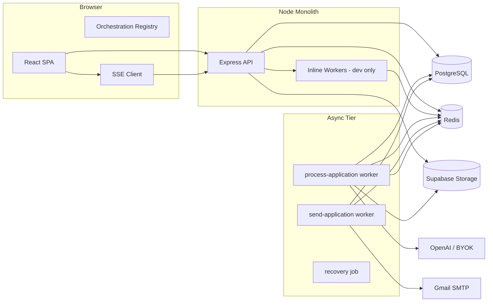
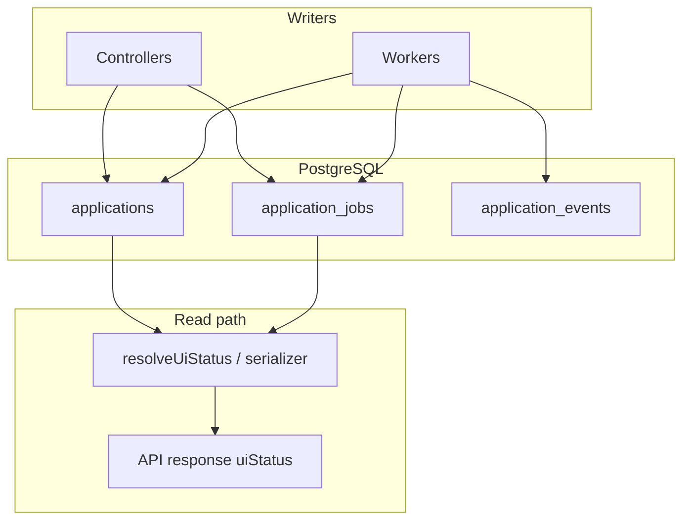
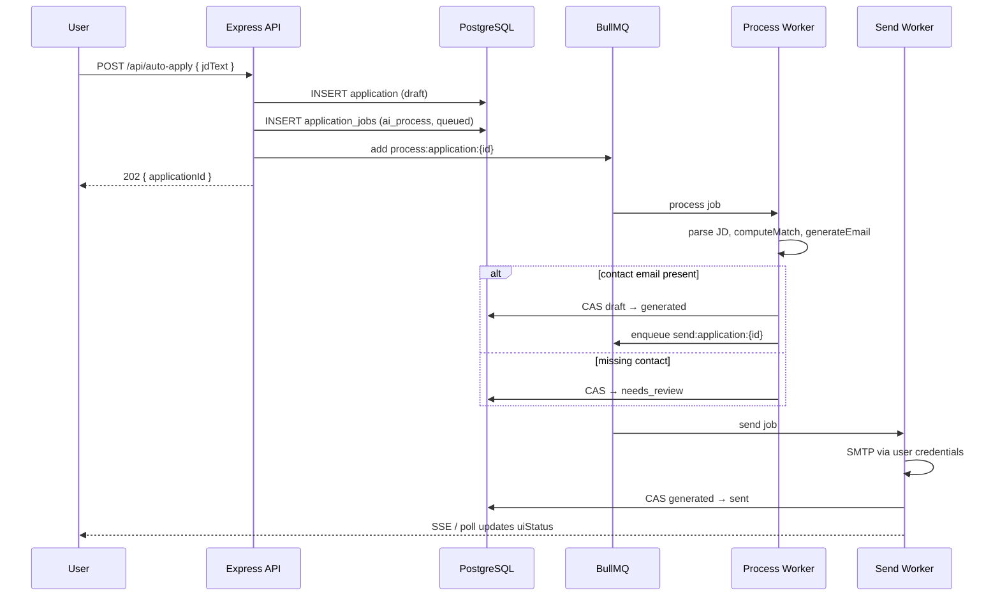
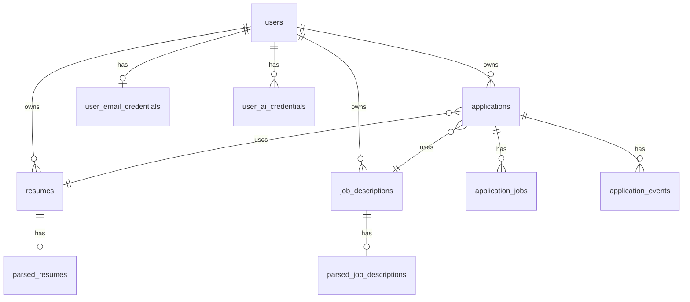

# One Tap — Technical Product Requirements Document (Technical PRD)

> **Audience:** Engineers, architects, DevOps, security reviewers  
> **Last updated:** June 1, 2026  
> **Status:** Living document — code and `docs/` are source of truth where they conflict  
> **Companion doc:** [Product PRD](./PRD.md)

---

## Document metadata

| Field | Value |
| --- | --- |
| Repository | `ai-apply` (monorepo) |
| Stack | Node.js 20+, Express 5, React (Vite), PostgreSQL, Redis, BullMQ |
| Auth | Supabase JWT (JWKS verification) |
| AI | OpenAI-compatible gateway + optional Ollama; BYOK per user |
| Email | Nodemailer → Gmail SMTP (user credentials, AES encrypted) |
| Storage | Supabase Storage (resume/JD files) |

---

## Table of contents

1. [System purpose](#system-purpose)
2. [North Star metrics](#north-star-metrics)
3. [Architecture overview](#architecture-overview)
4. [Truth model & state machine](#truth-model--state-machine)
5. [Technical product flows](#technical-product-flows)
6. [API surface](#api-surface)
7. [Data model](#data-model)
8. [Async processing & queues](#async-processing--queues)
9. [Realtime & client orchestration](#realtime--client-orchestration)
10. [AI pipeline](#ai-pipeline)
11. [Security & compliance](#security--compliance)
12. [Deployment & operations](#deployment--operations)
13. [Implementation status](#implementation-status)
14. [Technical debt & known issues](#technical-debt--known-issues)
15. [Improvement scope (engineering)](#improvement-scope-engineering)
16. [Feature scope (technical)](#feature-scope-technical)
17. [Use cases (technical)](#use-cases-technical)
18. [ADRs & conventions](#adrs--conventions)
19. [Testing strategy](#testing-strategy)
20. [Future architecture](#future-architecture)

---

## System purpose

One Tap is an **async-first** job application automation service:

1. Persist user inputs (resume, JD, credentials).
2. Enqueue durable work on Redis (BullMQ).
3. Workers perform LLM parsing, deterministic matching, email generation, and SMTP.
4. Expose derived status to clients via REST + SSE.

**Design principle:** HTTP initiates; workers complete; clients never trust a single `status` column for UI.

---

## North Star metrics

### Current North Star (shipping now)

**Applications Successfully Sent**

- Definition: count of applications that reach terminal business status `sent`.
- Why now: already trackable from existing `applications` state model and operations.
- Calculation window: daily/weekly/monthly by user cohort and global aggregate.

### Future / ultimate North Star (post response tracking)

**Recruiter Response Rate**

- Definition: `applications with recruiter response / applications sent` for a given window.
- Why ultimate: optimizes for interview outcomes, not just output volume.
- Activation condition: enabled once reliable response tracking is implemented in product + data pipeline.

### Supporting metrics (bridge from current to future)

- Send success rate
- Time to sent (p50/p95)
- Needs review rate
- Manual edit rate (email quality proxy)
- Response-capture coverage (% sent apps eligible for response tracking)

---

## Architecture overview

### Topology



### Component responsibilities

| Component | Path / entry | Responsibility |
| --- | --- | --- |
| API | `index.js`, `src/routes/*`, `src/controllers/*` | Auth, validation, CRUD, enqueue, SSE stream |
| Workers | `src/workers/` | AI lifecycle, send, CAS transitions, events, publish |
| Client | `client/src/` | Setup, dashboard, applications grid, realtime |
| Migrations | `src/migrations/*.sql` | Schema evolution (22 files) |
| Config | `src/config/` | Env, AI, queues, server (constants in code for concurrency) |

### Sync vs async boundary

| Synchronous (HTTP) | Asynchronous (workers) |
| --- | --- |
| Auth, profile, setup status | JD parse, resume parse (where worker-owned) |
| Upload resume/JD metadata | Match computation + email generation |
| Create `applications` + `application_jobs` rows | SMTP send |
| Enqueue BullMQ (`202 Accepted`) | Recovery re-enqueue |
| Status poll, list, detail | LLM calls, publish realtime |

---

## Truth model & state machine

### Four layers (mandatory mental model)

```txt
applications       = business truth
application_jobs   = execution truth
application_events = audit truth
uiStatus           = derived truth (NEVER persisted)
```



### Business statuses (`applications.application_status`)

| Value | Meaning |
| --- | --- |
| `draft` | Created; AI pipeline not finished |
| `generated` | Email drafted; eligible to send |
| `needs_review` | `review_reason` set (e.g. missing contact) |
| `sent` | SMTP success; terminal |
| `failed` | Workflow failed; automation stopped |
| `cancelled` | User cancelled; terminal |

Mutations: `transitionApplicationState()` with **CAS** (compare-and-swap) expectations.

### Job statuses (`application_jobs.status`)

| Value | Meaning |
| --- | --- |
| `queued` | Waiting for worker |
| `processing` | Worker active |
| `retrying` | Recovery/retry |
| `completed` | Attempt succeeded |
| `failed` | **This attempt** failed (row kept on retry) |

Job types: `ai_process`, `send_email`.

**Invariant:** On retry, insert a **new** `application_jobs` row; do not rewrite failed attempt rows.

### Orchestration fields

| Column | Purpose |
| --- | --- |
| `orchestration_version` | Monotonic counter for event ordering |
| `orchestration_epoch` | Bumped on revive/invalidate (client reconciliation) |

### Derived capabilities (API)

Status bundle includes: `uiStatus`, `pollable`, `terminal`, `canRetry`, `canContinue` — from `applicationSerializer` / `resolveCapabilities`, not raw enums alone.

---

## Technical product flows

### Flow 1 — Auto-apply (primary)



**Code anchors:**

- Controller: `src/controllers/autoApplyController.js` (via `autoApplyRoutes.js`)
- Worker: `src/workers/processApplication.worker.js`
- Send: `src/workers/sendApplication.worker.js`

### Flow 2 — Continue (needs_review → send)

| Step | Detail |
| --- | --- |
| Trigger | `POST /api/applications/:id/continue` |
| Precondition | `application_status === needs_review`, valid recipient |
| Action | Enqueue `send_email` job; CAS transitions per send worker |

### Flow 3 — Retry

| Step | Detail |
| --- | --- |
| Trigger | `POST /api/applications/:id/retry` |
| Action | New `application_jobs` row; re-enqueue process or send per resolver |
| Client | `broadcastRevive`, bump epoch, set `pollable` |

### Flow 4 — Resume upload

| Step | Detail |
| --- | --- |
| Trigger | `POST /api/upload-resume` (multipart) |
| Path | Hash → Supabase storage → PDF extract → LLM parse → `parsed_resumes` |
| Note | Documented instability on free models — see `failure-log.md` |

### Flow 5 — Setup status

| Step | Detail |
| --- | --- |
| Trigger | `GET /api/user/setup-status` |
| Returns | `hasResume`, `hasValidResume`, `hasEmailSetup`, `hasAiSetup`, active entities |

---

## API surface

Base: `/api`. Auth: `Authorization: Bearer <supabase_access_token>` unless noted.

### Core routes (implemented)

| Method | Path | Purpose |
| --- | --- | --- |
| GET | `/user/me` | Profile |
| GET | `/user/setup-status` | Setup gating |
| GET/PUT | `/user/defaults` | User defaults |
| POST | `/upload-resume` | Resume upload + parse |
| POST | `/upload-jd` | JD upload (alternate to paste) |
| POST | `/auto-apply` | Create application + enqueue AI |
| POST | `/send-application/:applicationId` | Manual send queue |
| GET | `/applications` | Paginated list + filters |
| GET | `/applications/:id` | Detail |
| GET | `/applications/:id/status` | Poll bundle + ETag |
| POST | `/applications/:id/continue` | Continue after review |
| POST | `/applications/:id/retry` | Retry workflow |
| POST | `/applications/:id/cancel` | Cancel |
| GET | `/application-jobs/:id` | Job detail |
| GET | `/orchestration/active` | Active orchestration snapshot |
| GET | `/realtime/stream` | SSE |
| POST | `/save-email-credentials` | Gmail credentials |
| GET/POST/... | `/ai/credentials/*` | BYOK management |
| GET | `/ai/providers` | Provider catalog |
| POST | `/apply/` | Legacy apply (prefer auto-apply) |

OpenAPI (dev): `http://localhost:5000/docs`

**Reference:** [../api/README.md](../api/README.md)

---

## Data model

### ER summary



### Key tables

| Table | Layer | Notes |
| --- | --- | --- |
| `applications` | Business | Status, email fields, match_score, orchestration_*, email_metadata |
| `application_jobs` | Execution | job_type, status, bullmq_job_id |
| `application_events` | Audit | Append-only; actor_type: system, user, worker |
| `user_email_credentials` | Secrets | Encrypted app password |
| `user_ai_credentials` | Secrets | BYOK + chain order |
| `llm_usage_logs` | Observability | Token/cost |
| `failed_parses` | Diagnostics | Hash-keyed parse failures |

**Schema source:** `src/migrations/` — see [../database/schema.md](../database/schema.md)

### Auth schema (Supabase cutover)

| Migration | Purpose |
| --- | --- |
| `017_supabase_auth_users.sql` | Add `supabase_user_id`, non-destructive |
| `018_supabase_auth_finalize.sql` | Drop legacy password after link verification |

**Rule:** Never change `users.id` — FK ownership preserved.

---

## Async processing & queues

### Queues

| Queue name | Deterministic job ID | Worker |
| --- | --- | --- |
| `process-application` | `process:application:{applicationId}` | `processApplication.worker.js` |
| `send-application` | `send:application:{applicationId}` | `sendApplication.worker.js` |

### Concurrency (code constants)

| Worker | Concurrency |
| --- | --- |
| process | 2 per process |
| send | 3 per process |

Scale horizontally: `npm run worker` replicas.

### Idempotency

- Deterministic BullMQ IDs prevent duplicate active jobs (ADR-002).
- Rate limits on apply, continue, retry, send routes.

### Recovery

- `recovery.job.js` re-enqueues stuck work per indexes in migrations `012`, `013`.

**Docs:** [../queues/README.md](../queues/README.md), [../architecture/async-processing.md](../architecture/async-processing.md)

---

## Realtime & client orchestration

### Server

| Mechanism | Path / module |
| --- | --- |
| SSE stream | `GET /api/realtime/stream` |
| Publish | `src/realtime/publishApplicationUpdate.js` |
| Redis bridge (optional) | `redisRealtimeBridge.js` |
| Dedupe | `publishDedupeRegistry.js` |

### Client

| Module | Role |
| --- | --- |
| `RealtimeProvider` | SSE connection, query invalidation |
| `globalOrchestrationRegistry` | Per-application version/epoch |
| `orchestrationTabLeader` | Single tab owns SSE |
| Reconciliation | `shouldApplyEvent`, version/epoch checks |
| Polling | `useApplicationStatusPoll`, `shouldPoll` from capabilities |

**Docs:** [../frontend/realtime-orchestration.md](../frontend/realtime-orchestration.md), [../architecture/realtime-architecture.md](../architecture/realtime-architecture.md)

### Client routes

```
/login, /auth/callback
/dashboard, /applications, /setup (protected)
```

---

## AI pipeline

### Process worker pipeline (ordered)

1. Load application (must be `draft` for process).
2. `parseJobDescription` → update JD derived fields.
3. `computeMatch(resume, jd)` — deterministic, `matchingService.js`.
4. `generateApplicationEmail` — LLM via `aiGateway`, user credential chain.
5. Branch:
   - Contact found → `generated` + enqueue send.
   - Missing contact → `needs_review` + `review_reason`.

### Providers

| Provider | Use |
| --- | --- |
| OpenAI (platform `OPENAI_API_KEY`) | Fallback |
| User credentials | Primary via `user_ai_credentials` chain |
| Ollama | Local dev optional (`ollama.provider.js`) |

### Email metadata (Phase 1 — shipped schema)

- `applications.email_metadata` JSONB — generation quality snapshot
- `applications.email_feedback_signals` JSONB — **future** engagement hooks
- Stub: `recordEmailFeedback()` in `emailFeedbackService.js`

**Doc:** [../ai/email-generation-metadata.md](../ai/email-generation-metadata.md)

### Provider capabilities (future hooks in code)

`capabilities.js` documents TODO flags: tool calling, embeddings, streaming, vision — not implemented.

---

## Security & compliance

| Area | Implementation |
| --- | --- |
| Authentication | Supabase JWT, JWKS verification (`supabaseJwtVerifier.js`) |
| Authorization | `req.user.id` internal UUID; row-level ownership in queries |
| Secrets | `ENCRYPTION_KEY` for email + AI credentials at rest |
| Rate limiting | `express-rate-limit` on sensitive routes |
| CORS | `CORS_ORIGIN` for production frontend |
| Replay / revocation | **Not implemented** — JWT valid until expiry; see [../security/replay-attack-limitation.md](../security/replay-attack-limitation.md) |
| RLS | Future Supabase RLS when on Supabase Postgres — API enforces today |

---

## Deployment & operations

### Production layout (current)

| Service | Host | Command |
| --- | --- | --- |
| API + workers (combined) | Render | `npm start` → `src/bootstrap.js` |
| Frontend | Vercel | `VITE_API_URL` → Render |

`WORKER_MODE=combined` on single Render service.

### Future split (no code change)

| Service | Command |
| --- | --- |
| API only | `npm run start:api` |
| Workers | `npm run worker` |

### Required env (production)

`DATABASE_URL`, `REDIS_URL`, `ENCRYPTION_KEY`, `SUPABASE_*`, `OPENAI_API_KEY`, `INTERNAL_API_KEY`, `NODE_ENV=production`

**Docs:** [../deployment/render.md](../deployment/render.md), [../deployment/production-startup-order.md](../deployment/production-startup-order.md)

### Health

- `GET /health` — Render health check

### Observability

- Pino structured logging
- Optional Sentry (`SENTRY_DSN`)
- Runbooks: [../troubleshooting/runbooks/stuck-jobs.md](../troubleshooting/runbooks/stuck-jobs.md)

---

## Implementation status

### Completed (verified in codebase)

| Area | Evidence |
| --- | --- |
| Four-layer state model | ADR-001, `state-model.md`, serializers |
| CAS transitions | `transitionApplicationState`, ADR-003 |
| BullMQ workers + deterministic IDs | `src/workers/`, ADR-002 |
| Auto-apply + send queues | `autoApplyRoutes`, workers |
| Supabase auth (Google) | `client/src/auth/`, `supabaseAuthMiddleware` |
| Applications list API + UI filters | `listApplicationsController`, `ApplicationsToolbar` |
| SSE + orchestration | `realtimeRoutes`, client registry |
| BYOK AI credentials | `aiRoutes`, `AiProviderStatusCard` |
| Email metadata columns | migration `015_email_generation_metadata.sql` |
| Migrations 001–018 | `src/migrations/` |
| Test suite | Jest — orchestration, CAS, auth, parsers, etc. |

### Partial / unstable

| Area | Notes |
| --- | --- |
| Resume parsing | `failure-log.md` — timeouts, 429, retry lifecycle issues on some paths |
| HTTP-owned vs worker-owned parse | Resume upload may block; target is full worker ownership per ADR-005 |
| Email feedback signals | Schema only; no product UI |
| Provider capabilities (advanced) | Flags stubbed in `capabilities.js` |

### Not implemented (documented only)

| Area | Reference |
| --- | --- |
| Recruiter response tracking pipeline | Product roadmap + `email_feedback_signals` hooks (schema present, full pipeline pending) |
| JWT revocation / session store | `future-architecture.md`, security doc |
| Priority queues / paid tier | `queues/scaling.md` |
| WebSocket realtime | ADR-006 chose SSE |
| Event partitioning/archival | ADR-007 future |
| ATS ranking pipeline | `future-architecture.md` |
| Semantic JD cache | Roadmap |
| Postgres RLS | `supabase-auth-cutover.md` |

---

## Technical debt & known issues

| ID | Issue | Severity | Owner action |
| --- | --- | --- | --- |
| TD-1 | Free-tier LLM timeouts on resume parse | High | Remove free models; isolate AbortController per retry |
| TD-2 | `llm_usage_logs` / `failed_parses` constraint failures under load | Medium | Fix migrations + error handling |
| TD-3 | Combined API+worker on Render | Medium | Split when CPU saturates |
| TD-4 | Dual path poll + SSE client CPU on large lists | Low | Adaptive subscribe (roadmap) |
| TD-5 | Legacy `POST /api/apply/` | Low | Deprecate in docs/clients |
| TD-6 | No token revocation | Medium | Session store ADR |

**Internal log:** `failure-log.md` at repo root (resume parsing session).

---

## Improvement scope (engineering)

### P0 — Reliability

- [ ] Worker-isolated resume parsing (align with ADR-005)
- [ ] Provider timeout separate from HTTP timeout
- [ ] Production AI model allowlist (no free OpenRouter models)
- [ ] Harden `failed_parses` and telemetry writes

### P1 — Operability

- [ ] Split Render services (API vs worker)
- [ ] Redis dedicated instance per queue tier at scale
- [ ] Materialized view or read replica for heavy list/status polls
- [ ] Partition `application_events` by month

### P2 — Platform

- [ ] Implement `recordEmailFeedback` + webhook for bounces/replies
- [ ] Build recruiter response tracking end-to-end (capture, normalize, attribute to application, and expose response-rate analytics)
- [ ] Outbox pattern for exactly-once side effects
- [ ] JWT revocation service
- [ ] Supabase RLS policies matching `users.supabase_user_id`

### P3 — AI platform

- [ ] Embeddings for semantic match (capabilities flag)
- [ ] Streaming partial generation to UI
- [ ] Vision path for scanned resumes
- [ ] ATS scoring microservice or queue

---

## Feature scope (technical)

### In scope (current sprint baseline)

| Feature | Technical acceptance |
| --- | --- |
| Auto-apply | 202 response; deterministic job id; draft row + ai_process job |
| Status poll | ETag support; `pollable` derived |
| List endpoint | Pagination, sort, status filter, date range, search |
| Continue | Idempotent continue; rate limited |
| Retry | New job row; orchestration epoch bump |
| Cancel | Terminal cancelled; send rejected |
| Encrypt credentials | AES via `ENCRYPTION_KEY` |
| Publish realtime | Deduped SSE payloads with version/epoch |

### Planned next scope (north-star enabling)

| Feature | Technical acceptance |
| --- | --- |
| Recruiter response tracking | Capture reply signals from supported channels, map responses to `application_id`, and persist normalized response events |
| Response-rate analytics | Compute per-user and aggregate recruiter response rate from sent applications with auditable numerator/denominator definitions |
| Response status visibility | Expose response state in applications API/UI without breaking four-layer truth model |

### Out of scope (engineering)

- Multi-region active-active
- CRDT state sync
- gRPC internal APIs
- Non-Postgres primary store

---

## Use cases (technical)

### TUC-01 — Enqueue idempotency

**Given** duplicate `POST /auto-apply` or network retry  
**When** same `applicationId` already has active `process:application:{id}`  
**Then** BullMQ dedupes; no duplicate business rows

### TUC-02 — CAS send

**Given** `application_status === generated`  
**When** send worker completes SMTP  
**Then** only one transition to `sent`; duplicate send jobs no-op or skip per inspector

### TUC-03 — Stale SSE rejection

**Given** client has `orchestration_version = 5`  
**When** SSE delivers event with `version = 4`  
**Then** `shouldApplyEvent` drops update

### TUC-04 — Failed job retry

**Given** job row `failed` for attempt 1  
**When** user retries  
**Then** attempt 2 is new `application_jobs` row; attempt 1 unchanged

### TUC-05 — BYOK fallback

**Given** user chain [OpenAI, Anthropic]  
**When** OpenAI returns 429  
**Then** gateway tries next credential before platform key

### TUC-06 — Recovery job

**Given** job stuck in `processing` beyond threshold  
**When** recovery cron runs  
**Then** re-enqueue or mark failed per recovery policy

### TUC-07 — Recruiter response attribution

**Given** an outbound email was sent for `application_id = A`  
**When** a recruiter reply is captured from an integrated channel  
**Then** system normalizes and attributes the response to `A`, updates response-tracking state, and includes the event in recruiter response-rate metrics

---

## ADRs & conventions

### Accepted ADRs

| ADR | Decision |
| --- | --- |
| 001 | Three-truths state model (+ derived uiStatus) |
| 002 | Deterministic BullMQ job IDs |
| 003 | CAS state transitions |
| 004 | Thin controllers |
| 005 | Worker-owned AI lifecycle |
| 006 | SSE over WebSocket |
| 007 | Append-only events |

**Index:** [../adr/README.md](../adr/README.md)

### Code conventions

- Config via `src/config/` — concurrency not env-tunable
- Logs: Pino + `buildLogContext`
- Validation: Zod schemas where present
- Tests: `tests/` mirror critical orchestration paths

---

## Testing strategy

| Layer | Location | Coverage focus |
| --- | --- | --- |
| Unit | `tests/*.unit.test.js` | Parsers, matchers, middleware, serializers |
| Orchestration | `tests/orchestration/*` | SSE dedupe, reconciliation, terminal states, retry epoch |
| Integration | `tests/jdParser.integration.test.js` | Parser against live or mocked LLM |
| Stress | `tests/stressTest.js` | Load (manual) |

Run: `npm test`

**Gap:** E2E Playwright not present in repo — recommend for release gates.

---

## Future architecture

Consolidated from [../roadmap/future-architecture.md](../roadmap/future-architecture.md):

| Bottleneck | Evolution |
| --- | --- |
| `application_events` size | Partition/archive |
| uiStatus complexity | Rule split + test matrix |
| Single Redis | Tiered Redis |
| Colocated workers | Separate `ai` vs `send` pools |
| Poll + SSE | SSE-primary with adaptive subscribe |
| Status bundle DB load | Read replica / materialized view |

### Directional capabilities

- WebSocket (optional, bidirectional)
- Priority queues (paid tier)
- CDC to warehouse
- Semantic JD cache
- Multi-region (hard — single-writer regions)

**Do not implement from roadmap without new ADR.**

---

## Repository map (quick reference)

```txt
ai-apply/
├── client/                 # React SPA (Vite)
├── src/
│   ├── routes/             # Express routers
│   ├── controllers/        # Thin HTTP handlers
│   ├── services/           # Business logic
│   ├── workers/            # BullMQ consumers
│   ├── models/             # DB access
│   ├── realtime/           # SSE publish path
│   ├── migrations/         # SQL schema
│   └── config/             # Env + constants
├── docs/                   # Engineering docs
├── docs/product/           # This PRD set
└── tests/                  # Jest
```

---

## Related documentation

| Doc | Topic |
| --- | --- |
| [../README.md](../README.md) | Engineering hub |
| [../architecture/system-overview.md](../architecture/system-overview.md) | Architecture |
| [../architecture/state-model.md](../architecture/state-model.md) | State |
| [../glossary.md](../glossary.md) | Terms |
| [./PRD.md](./PRD.md) | Product PRD |

---

*Import tip for Notion:* Use **Import → Markdown** or paste sections into typed databases (e.g. map "Implementation status" table to a Notion database with Status = Done / Partial / Planned).
