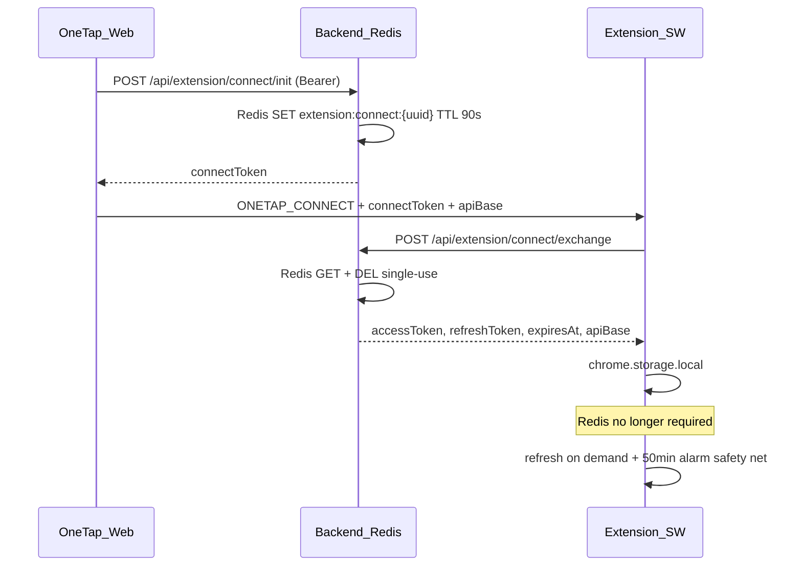

# Extension Auth — Phase 0.5b

Website-driven extension connect (Option A). No manual JWT copy/paste.

## Product model

- **Website:** Account, setup, applications, settings, status management
- **Extension:** Thin LinkedIn discovery client — detect posts, inject button, `POST /api/auto-apply`

## Lifecycle decisions

| Question | Decision |
|----------|----------|
| Works without website open? | **Yes** — `chrome.storage.local` |
| Survives browser restart? | **Yes** — same storage |
| Survives token expiration? | **Yes** — extension refreshes via stored `refreshToken` against Supabase `/auth/v1/token` |
| Survives logout? | **No** — web sign-out sends `ONETAP_DISCONNECT`; extension Disconnect clears local auth |
| Survives reinstall? | **No** — user must Connect again |
| Multiple browsers? | **Yes** — independent install + Connect per browser |
| Backend/Redis restart after connect? | **Yes** — Redis only used during 90s connect handshake |

## Auth flow



## Exchange response

Auth/session data only — **no** `supabaseUrl` or `supabaseAnonKey`:

```json
{
  "success": true,
  "data": {
    "accessToken": "...",
    "refreshToken": "...",
    "expiresAt": 1718400000,
    "apiBase": "http://localhost:5000"
  }
}
```

Supabase URL and anon key live in [`extension/src/config/app.config.js`](../../extension/src/config/app.config.js) (public config, not backend).

## Token refresh

- **Primary:** Refresh before API calls when within 60s of `expiresAt`
- **Secondary:** `chrome.alarms` every 50 minutes (safety net)
- **On failure:** Clear storage; prompt reconnect in Settings

## Logout

| Trigger | Web | Extension |
|---------|-----|-----------|
| Web sign out | Cleared | `ONETAP_DISCONNECT` clears storage |
| Extension Disconnect | Unchanged | Storage cleared |
| Refresh revoked | Unchanged | Cleared on next API call |

## Security

- Connect token: UUID, 90s TTL, single-use
- `externally_connectable`: localhost (dev), `*.onetap.app` (prod)
- Tokens in `chrome.storage.local` — isolated from LinkedIn content scripts
- Init requires Bearer auth; exchange requires one-time token

## Dev setup

1. Load unpacked extension from `extension/`
2. Copy `VITE_SUPABASE_URL` and `VITE_SUPABASE_ANON_KEY` from `client/.env` into `extension/src/config/app.config.js`
3. Copy extension ID from `chrome://extensions` → `client/.env` as `VITE_ONETAP_EXTENSION_ID`
4. Login → `/settings/extension` → Connect Extension

## Chrome Web Store

- Single purpose: LinkedIn job discovery → OneTap
- Permissions: `storage`, `activeTab`, `alarms`, LinkedIn + API origins
- Store build: remove localhost from manifest permissions

## Acceptance tests

1. Login → Settings → Connect — status shows Connected, version, connectedAt
2. Close all OneTap tabs — LinkedIn API works
3. Restart Chrome — still connected
4. Token near expiry — on-demand refresh succeeds
5. Web sign out — extension not connected
6. Reconnect without DevTools
7. Second browser — independent session
8. Extension Disconnect — extension cleared, web logged in
9. Wrong extension ID — clear error
10. Backend/Redis restart after connect — extension remains operational
