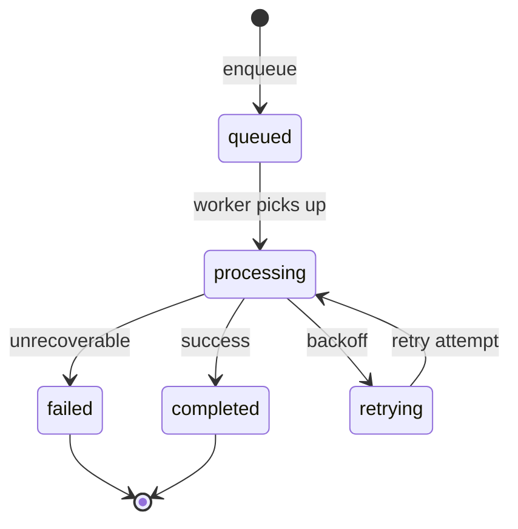

# Job lifecycle

BullMQ job states map to `application_jobs` rows.

## DB vs Redis

| Layer | Tracks |
|-------|--------|
| `application_jobs` | Business-visible execution history |
| BullMQ | Infrastructure retry, stall, delay |

## Stalled jobs

BullMQ emits `JOB_STALLED` — worker should handle; recovery job re-enqueues if stuck.

## Related Documentation

- [retry-and-backoff.md](retry-and-backoff.md)
- [../workers/README.md](../workers/README.md)
